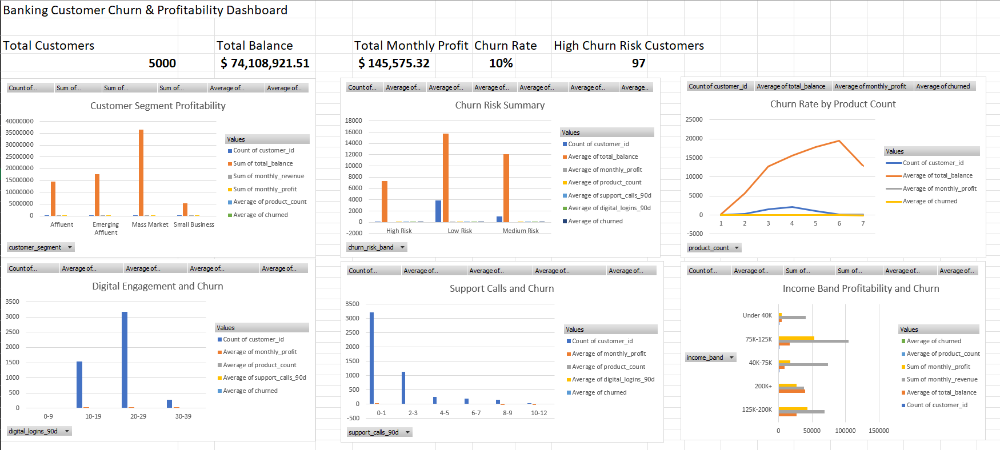

# Banking Customer Churn & Profitability Analytics

## Project Overview

The **Banking Customer Churn & Profitability Analytics** project is a professional portfolio project designed to simulate the type of customer analytics, profitability reporting, churn analysis, and retention strategy work used by banks, credit unions, FinTech companies, and financial services organizations.

This project analyzes synthetic banking customer data to understand customer behavior, account balances, product usage, profitability, digital engagement, service activity, churn risk, and retention opportunities.

The project demonstrates how an analyst can use **Python, SQL, Excel, machine learning, and business reporting** to turn customer-level banking data into practical insights for finance, operations, product, and customer retention teams.

This project is designed for roles such as:

* Financial Analyst
* Business Analyst
* Operations Analyst
* Banking Analyst
* FinTech Analyst
* Data Analyst
* Customer Insights Analyst
* Risk Operations Analyst


## 🌐 Live Interactive Dashboard

🔗 [View the Streamlit Dashboard](https://banking-customer-churn-profitability-analytics-a7hnw6cdqcguzny.streamlit.app/)

---

## Business Problem

Banks and financial institutions need to understand which customers are profitable, which customers are at risk of leaving, and what actions can improve retention and long-term customer value.

Customer churn can reduce revenue, weaken customer relationships, and increase the cost of acquiring replacement customers. At the same time, not every customer has the same value to the bank. Some customers have higher balances, more products, stronger profitability, and deeper engagement. Others may have low product usage, repeated support issues, low digital engagement, or negative profitability.

A banking analytics team needs to answer questions such as:

* Which customer segments are most profitable?
* What is the overall churn rate?
* Which customers are at highest risk of leaving?
* How does product usage affect churn?
* How does digital engagement relate to churn risk?
* Do support calls indicate customer dissatisfaction?
* Which high-value customers should be prioritized for retention?
* Which customers may be good candidates for cross-sell opportunities?
* What factors are most useful for predicting churn?
* How can leadership monitor churn and profitability through an executive dashboard?

This project answers those questions through a structured banking analytics workflow.

---

## Tools and Technologies Used

* **Python** — data creation, analysis, churn modeling, and KPI calculation
* **Pandas** — data cleaning, grouping, aggregation, and reporting
* **NumPy** — numerical operations and synthetic data generation
* **Matplotlib** — visual analysis in the notebook
* **Scikit-learn** — machine learning model for churn prediction
* **Jupyter Notebook** — step-by-step analysis workflow
* **SQL** — business queries for churn, profitability, product usage, and retention analysis
* **Excel** — PivotTables, KPI cards, and executive dashboard creation
* **GitHub** — project documentation and version control

---

## Dataset Description

This project uses synthetic data created for portfolio and learning purposes. No real customer data, bank data, employer data, or confidential financial information is used.

The project includes three datasets:

### 1. Bank Customer Profiles Dataset

This dataset contains customer demographic and profile-level information, including:

* Customer ID
* State
* Age group
* Income band
* Customer segment
* Credit score band
* Tenure band
* Estimated income
* Estimated tenure years
* Estimated credit score

### 2. Bank Account Activity Dataset

This dataset contains account behavior, product ownership, activity, revenue, cost, profitability, and churn indicators, including:

* Checking balance
* Savings balance
* Total balance
* Credit card ownership
* Personal loan ownership
* Mortgage ownership
* Investment account ownership
* Business account ownership
* Product count
* Digital logins in the last 90 days
* Branch visits in the last 90 days
* Support calls in the last 90 days
* Monthly deposits
* Monthly card spend
* Monthly revenue
* Servicing cost
* Monthly profit
* Churn probability
* Churn risk band
* Churned status

### 3. Combined Banking Churn and Profitability Dataset

This dataset combines customer profile information with account activity and churn-related metrics. It is the main dataset used for the analysis, SQL queries, and Excel dashboard.

---

## Repository Structure

```text
banking-customer-churn-profitability-analytics/
│
├── data/
│   ├── bank_customer_profiles.csv
│   ├── bank_account_activity.csv
│   └── banking_churn_profitability_data.csv
│
├── notebooks/
│   └── banking_churn_profitability_analysis.ipynb
│
├── sql/
│   └── banking_churn_profitability_queries.sql
│
├── dashboard/
│   ├── banking_churn_profitability_dashboard.xlsx
│   └── banking_dashboard_screenshot.png
│
├── reports/
│   └── insights.md
│
├── models/
│   └── README.md
│
├── requirements.txt
└── README.md
```

---

## Project Workflow

### 1. Synthetic Data Creation

The project begins by creating a synthetic banking dataset in a Jupyter Notebook. The dataset was designed to represent a realistic U.S.-based retail banking environment with customer profiles, balances, product usage, revenue, cost, profitability, engagement behavior, and churn indicators.

The synthetic data includes different customer segments such as:

* Mass Market
* Emerging Affluent
* Affluent
* Small Business

The goal was to create a realistic business dataset that can support churn analysis, profitability analysis, product usage analysis, and executive dashboard reporting.

### 2. Customer Profile and Account Activity Development

Customer profile data was created first, including state, age group, income band, customer segment, credit score band, and tenure band.

Account activity data was then generated using profile-based assumptions. For example, customers with higher estimated income or affluent segments were more likely to have higher balances or additional financial products.

### 3. Profitability Calculation

Monthly revenue was estimated using several sources of banking revenue, including deposit-related revenue, card spend revenue, loan revenue, mortgage revenue, investment account revenue, and business account revenue.

Monthly profit was calculated by subtracting estimated servicing cost from monthly revenue.

This allows the project to analyze not only customer churn, but also whether customers are profitable or costly to serve.

### 4. Churn Probability and Churn Risk Scoring

Each customer was assigned a churn probability based on factors such as:

* Customer tenure
* Product count
* Support calls
* Digital engagement
* Monthly profit
* Balance level
* Product depth

Customers were then grouped into churn risk bands:

* Low Risk
* Medium Risk
* High Risk

This helps simulate how a bank might identify customers who need retention attention.

### 5. Executive KPI Summary

High-level banking KPIs were calculated, including:

* Total customers
* Total customer balance
* Average customer balance
* Total monthly revenue
* Total monthly profit
* Average products per customer
* Churn rate
* High churn risk customers

These metrics give leadership a quick summary of overall customer portfolio health.

### 6. Customer Segment Profitability Analysis

Customer segments were compared by number of customers, balances, revenue, profit, average product count, and churn rate.

This helps identify which segments contribute the most value and which segments may need retention or growth strategies.

### 7. Churn Risk Analysis

Churn risk bands were analyzed to compare customer balance, profitability, product count, support calls, digital activity, and churn rate.

This analysis helps explain how different customer behaviors are connected to churn risk.

### 8. Product Usage and Churn Analysis

The project analyzed how the number of banking products relates to churn. Customers with fewer products may be less connected to the bank and more likely to leave.

This analysis supports cross-sell and relationship-deepening strategies.

### 9. Digital Engagement Analysis

Digital login activity was grouped into engagement bands to review how digital behavior relates to churn. Low digital engagement may indicate customers who are less active, less satisfied, or less connected to the bank.

### 10. Support Activity and Churn Analysis

Support call activity was analyzed to understand whether repeated customer service contact is connected to higher churn risk. More support calls may indicate unresolved issues or customer frustration.

### 11. High-Value At-Risk Customer Identification

The analysis identified customers who are both valuable and at higher churn risk. These customers may be good candidates for proactive retention outreach because losing them could have a stronger financial impact.

### 12. Machine Learning Churn Model

A basic machine learning model was built using a Random Forest Classifier to predict customer churn.

The model used customer profile, balance, product usage, engagement, revenue, cost, and profitability features.

The goal of the model was not to create a perfect production-ready solution, but to demonstrate how customer data can be used to predict churn and identify important churn-related factors.

### 13. Feature Importance Review

Feature importance was reviewed to understand which customer attributes and behaviors were most useful for the churn model.

This helps connect the model output back to business decision-making.

### 14. SQL Analysis

SQL queries were written to support business review and reporting, including customer segment profitability, churn risk summaries, digital engagement analysis, support call analysis, state-level profitability, product ownership, cross-sell opportunities, negative-profit customers, and retention priority lists.

### 15. Excel Executive Dashboard

An Excel dashboard was created using PivotTables, KPI cards, and charts. The dashboard gives business users a quick view of churn, profitability, customer segments, product usage, digital engagement, support activity, and income band trends.

---

## Dashboard Preview



---

## Key Analysis Areas

The project focuses on the following business areas:

* Total customer base
* Total customer balances
* Monthly revenue
* Monthly profit
* Customer churn rate
* Churn risk bands
* High churn risk customers
* Customer segment profitability
* Product count and churn
* Digital engagement and churn
* Support calls and churn
* Income band profitability
* Product ownership
* High-value at-risk customers
* Negative-profit customers
* Cross-sell opportunities
* Machine learning churn prediction
* Feature importance analysis

---

## Key Insights

* Customer profitability varies significantly across customer segments.
* Customers with fewer banking products generally show higher churn risk.
* Lower digital engagement is associated with higher churn risk.
* Higher support call activity may indicate customer dissatisfaction or service friction.
* High-value customers with high churn risk should be prioritized for retention campaigns.
* Product depth, engagement, tenure, support activity, balances, and profitability are useful indicators for churn analysis.
* A machine learning model can help identify churn patterns and support proactive retention strategies.
* Executive dashboards can help leadership monitor customer portfolio health and retention risk more efficiently.

---

## Business Recommendations

Based on the analysis, the following recommendations were made:

* Prioritize retention outreach for high-value customers with high churn risk.
* Target low-product customers with relevant cross-sell offers to increase relationship depth.
* Improve follow-up processes for customers with repeated support calls.
* Encourage digital banking adoption among low-engagement customers.
* Monitor churn risk by customer segment, product count, tenure, and support activity.
* Review negative-profit customers to understand servicing costs and customer profitability drivers.
* Use churn scoring as an early warning system for retention teams.
* Build recurring executive dashboards to track churn, profitability, engagement, and retention performance.

---

## Machine Learning Summary

A basic Random Forest classification model was used to predict customer churn.

The model used both categorical and numerical features, including:

* State
* Age group
* Income band
* Customer segment
* Credit score band
* Tenure band
* Total balance
* Product count
* Digital logins
* Branch visits
* Support calls
* Monthly deposits
* Monthly card spend
* Monthly revenue
* Servicing cost
* Monthly profit

The model output included accuracy, classification metrics, a confusion matrix, and feature importance results.

This section demonstrates how machine learning can support banking churn analysis by identifying patterns across customer behavior and financial activity.

---

## Skills Demonstrated

This project demonstrates the following skills:

* Banking customer analytics
* Churn analysis
* Profitability analysis
* Customer segmentation
* Product usage analysis
* Digital engagement analysis
* Retention opportunity identification
* Machine learning model development
* Feature importance analysis
* Python data analysis
* Pandas aggregation and grouping
* SQL querying
* Excel PivotTables
* Excel executive dashboard creation
* Business insight reporting
* GitHub portfolio documentation

---

## How to Run This Project

### 1. Clone the Repository

```bash
git clone https://github.com/fitsa251/banking-customer-churn-profitability-analytics.git
```

### 2. Navigate Into the Project Folder

```bash
cd banking-customer-churn-profitability-analytics
```

### 3. Install Requirements

```bash
pip install -r requirements.txt
```

### 4. Open the Jupyter Notebook

Open and run the notebook below:

```text
notebooks/banking_churn_profitability_analysis.ipynb
```

### 5. Review the Excel Dashboard

Open the Excel dashboard file:

```text
dashboard/banking_churn_profitability_dashboard.xlsx
```

---

## Project Files

| File                                                   | Description                                                                                     |
| ------------------------------------------------------ | ----------------------------------------------------------------------------------------------- |
| `data/bank_customer_profiles.csv`                      | Synthetic customer profile dataset                                                              |
| `data/bank_account_activity.csv`                       | Synthetic customer account activity dataset                                                     |
| `data/banking_churn_profitability_data.csv`            | Combined banking churn and profitability dataset                                                |
| `notebooks/banking_churn_profitability_analysis.ipynb` | Python notebook for data creation, churn analysis, profitability analysis, and machine learning |
| `sql/banking_churn_profitability_queries.sql`          | SQL queries for banking churn, profitability, product usage, and retention analysis             |
| `dashboard/banking_churn_profitability_dashboard.xlsx` | Excel executive dashboard workbook                                                              |
| `dashboard/banking_dashboard_screenshot.png`           | Dashboard preview image                                                                         |
| `reports/insights.md`                                  | Final business insights and recommendations                                                     |
| `requirements.txt`                                     | Python package requirements                                                                     |

---

## Project Status

**Completed**

This project is complete and ready to be included in a professional banking, finance, FinTech, operations, business analytics, or data analytics portfolio.

---

## Important Note

This project uses synthetic data only. No confidential company data, customer data, employer data, bank data, or private financial information is used.
